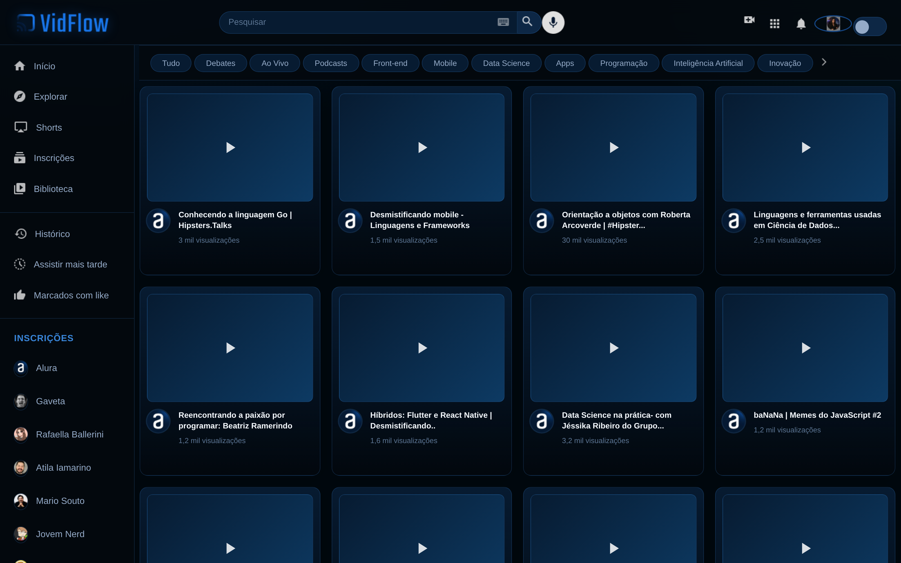
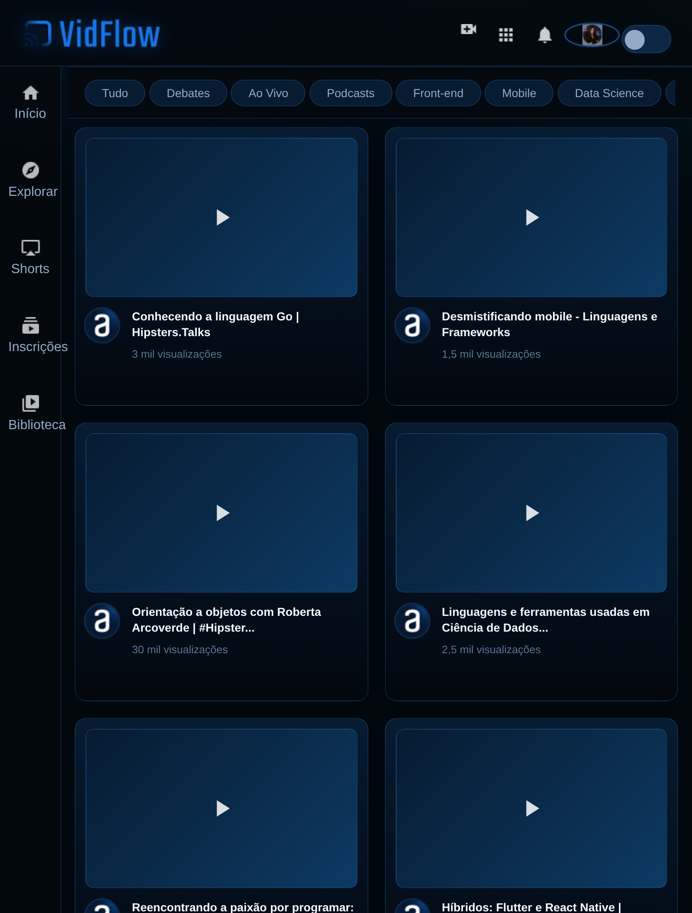
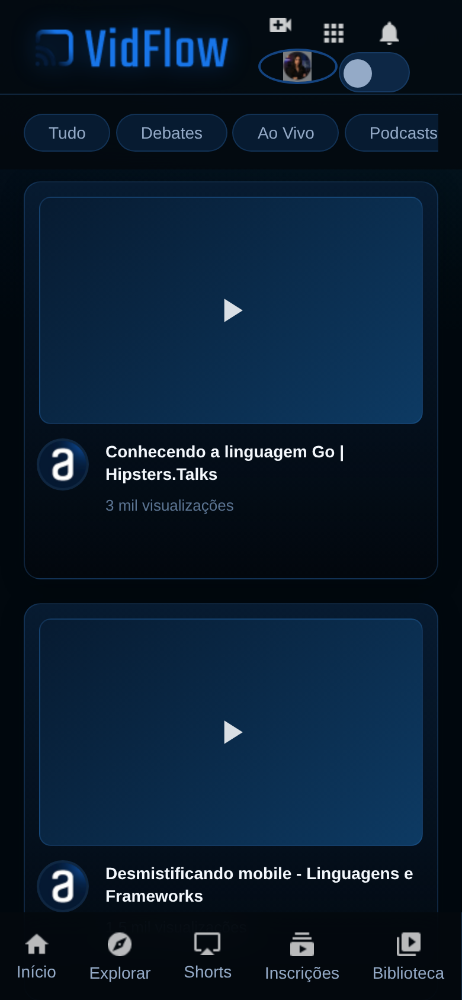

# 🎬 VIDFLOW

Projeto desenvolvido durante o curso **[Node.js e terminal: dominando o ambiente de desenvolvimento front-end](https://cursos.alura.com.br/classpage/node-js-terminal-ambiente-desenvolvimento-front-end/task/144377)** da Alura.

O **VidFlow** é uma plataforma de vídeos utilizada como projeto prático para aplicar conceitos do ecossistema Node.js, gerenciamento de pacotes, consumo de API e ferramentas modernas de desenvolvimento Front-end.

## 🌐 Projeto online

🔗 **[Acessar o VidFlow](https://nodejs-vidflow-ecru.vercel.app/)**

🔗 **[Acessar a API](https://nodejs-vidflow-api.onrender.com/videos)**

## 🖥️ Responsividade

O projeto foi desenvolvido considerando diferentes tamanhos de tela.

### 💻 Desktop



### 📱 Tablet



### 📱 Mobile



## 🛠️ Tecnologias

* Node.js
* NPM
* JavaScript
* Axios
* JSON Server
* Vite
* HTML5
* CSS3
* ESLint
* Prettier

## 📚 O que foi praticado

* Configuração do ambiente com Node.js
* Gerenciamento de pacotes com NPM
* Scripts no `package.json`
* Dependências de desenvolvimento e produção
* Consumo de API com Axios
* Utilização do JSON Server
* Configuração e utilização do Vite
* Git e GitHub
* Build e Deploy

## 🚀 Implementações adicionais

Além do conteúdo original do curso, foram realizadas implementações para colocar o projeto em ambiente de produção.

### API

A API foi configurada e publicada no **Render**, utilizando uma URL própria:

🔗 **[VidFlow API](https://nodejs-vidflow-api.onrender.com/videos)**

### Front-end

O Front-end foi configurado para utilizar a API publicada e disponibilizado na **Vercel**.

🔗 **[Acessar o VidFlow](https://nodejs-vidflow-ecru.vercel.app/)**

## 💻 Como executar localmente

Clone o repositório e instale as dependências:

```bash
npm install
```

Inicie o projeto:

```bash
npm run dev
```

Para executar a API localmente:

```bash
npm run api-local
```

## 👩‍💻 Desenvolvido por

**Milena Amaral**

🔗 **[GitHub](https://github.com/MilenaAmaral)**

## 🎓 Curso

**Alura | Node.js e terminal: dominando o ambiente de desenvolvimento front-end**

🔗 **[Acessar curso](https://cursos.alura.com.br/classpage/node-js-terminal-ambiente-desenvolvimento-front-end/task/144377)**
